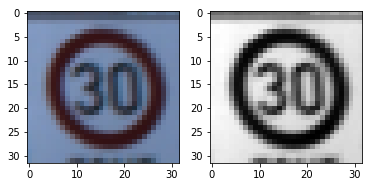

# **Traffic Sign Recognition** 

---

**Build a Traffic Sign Recognition Project**

The goals / steps of this project are the following:
* Load the data set (see below for links to the project data set)
* Explore, summarize and visualize the data set
* Design, train and test a model architecture
* Use the model to make predictions on new images
* Analyze the softmax probabilities of the new images
* Summarize the results with a written report


---
### README

### Data Set Summary & Exploration

#### 1. I used the np.array.shpape to calculate summary statistics of the traffic
signs data set:

* The size of training set is 34799
* The size of the validation set is 4410
* The size of test set is 12630
* The shape of a traffic sign image is [32, 32, 3]
* The number of unique classes/labels in the data set is 43

echo "<br />"
#### 2. Here is an exploratory visualization of the data set. It is a bar chart showing how the distribution of classes in the training validation and test set


echo "<br />"
### Design and Test a Model Architecture

#### 1. As a first step, I decided to convert the images to grayscale because gray image can improve the accuracy

Here is an example of a traffic sign image before and after grayscaling.



echo "<br />"
#### 2. As a last step, I normalized the image data because it can prevent overfitting
```python

X_train_gray = np.zeros((X_train.shape[0], X_train.shape[1], X_train.shape[2], 1))
for i in range(len(X_train)):
    X_train_gray[i] = (((cv2.cvtColor(X_train[i],cv2.COLOR_RGB2GRAY)).astype(np.int16) - 128) / 128).reshape([32,32,1]) 
    
```

echo "<br />"
#### 3. Model Architecture

My final model consisted of the following layers:

| Layer         		|     Description	        					| 
|:---------------------:|:---------------------------------------------:| 
| Input         		| 32x32x3 RGB image   							| 
| Convolution 5x5     	| 1x1 stride, VALID padding, outputs 28x28x6 	|
| RELU					|												|
| Avg pooling 2x2	      	| 1x1 stride,  outputs 27x27x6 				|
| Convolution 5x5     	| 1x1 stride, VALID padding, outputs 23x23x16 	|
| RELU					|												|
| Max pooling	2x2      	| 1x1 stride,  outputs 22x22x16 				|
| Convolution 5x5     	| 1x1 stride, VALID padding, outputs 18x18x32 	|
| RELU					|												|
| Max pooling	2x2      	| 2x2 stride,  outputs 9x9x32 				|
| Fully Connected     	| Input = 2592. Output = 1024 				|
| RELU					|												|
| Fully Connected     	| Input = 1024. Output = 512 				|
| RELU					|												|
| Fully Connected     	| Input = 512. Output = 43 				|
| RELU					|												|
| Argmax         		| Input = 43. Output = 1    							| 
| Output         		|  Output = 1 							| 


echo "<br />"
#### 4. Parameters

**type of optimizer** : tf.train.AdamOptimizer
**batch size** : 64
**number of epochs** : 20
**learning rate** :  0.001

echo "<br />"
#### 5. Accuracy approaching 

My final model results were:
* training set accuracy of 0.997
* validation set accuracy of 0.966 
* test set accuracy of 0.957

echo "<br />"
### Test a Model on New Images

#### 1. Choose five German traffic signs found on the web and provide them in the report. For each image, discuss what quality or qualities might be difficult to classify.

Here are five German traffic signs that I found on the web:

![alt text][image4] ![alt text][image5] ![alt text][image6] 
![alt text][image7] ![alt text][image8]


The first image might be difficult to classify because ...

#### 2. Discuss the model's predictions on these new traffic signs and compare the results to predicting on the test set. At a minimum, discuss what the predictions were, the accuracy on these new predictions, and compare the accuracy to the accuracy on the test set (OPTIONAL: Discuss the results in more detail as described in the "Stand Out Suggestions" part of the rubric).

Here are the results of the prediction:

| Image			        |     Prediction	        					| 
|:---------------------:|:---------------------------------------------:| 
| Stop Sign      		| Stop sign   									| 
| U-turn     			| U-turn 										|
| Yield					| Yield											|
| 100 km/h	      		| Bumpy Road					 				|
| Slippery Road			| Slippery Road      							|


The model was able to correctly guess 4 of the 5 traffic signs, which gives an accuracy of 80%. This compares favorably to the accuracy on the test set of ...

#### 3. Describe how certain the model is when predicting on each of the five new images by looking at the softmax probabilities for each prediction. Provide the top 5 softmax probabilities for each image along with the sign type of each probability. (OPTIONAL: as described in the "Stand Out Suggestions" part of the rubric, visualizations can also be provided such as bar charts)

The code for making predictions on my final model is located in the 11th cell of the Ipython notebook.

For the first image, the model is relatively sure that this is a stop sign (probability of 0.6), and the image does contain a stop sign. The top five soft max probabilities were

| Probability         	|     Prediction	        					| 
|:---------------------:|:---------------------------------------------:| 
| .60         			| Stop sign   									| 
| .20     				| U-turn 										|
| .05					| Yield											|
| .04	      			| Bumpy Road					 				|
| .01				    | Slippery Road      							|


For the second image ... 

### (Optional) Visualizing the Neural Network (See Step 4 of the Ipython notebook for more details)
#### 1. Discuss the visual output of your trained network's feature maps. What characteristics did the neural network use to make classifications?


