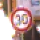

# **Traffic Sign Recognition** 

---

**Build a Traffic Sign Recognition Project**

The goals / steps of this project are the following:
* Load the data set (see below for links to the project data set)
* Explore, summarize and visualize the data set
* Design, train and test a model architecture
* Use the model to make predictions on new images
* Analyze the softmax probabilities of the new images
* Summarize the results with a written report


---
### README

### Data Set Summary & Exploration

#### 1. I used the np.array.shpape to calculate summary statistics of the traffic
signs data set:

* The size of training set is 34799
* The size of the validation set is 4410
* The size of test set is 12630
* The shape of a traffic sign image is [32, 32, 3]
* The number of unique classes/labels in the data set is 43


#### 2. Here is an exploratory visualization of the data set. It is a bar chart showing how the distribution of classes in the training validation and test set


### Design and Test a Model Architecture

#### 1. As a first step, I decided to convert the images to grayscale because gray image can improve the accuracy

Here is an example of a traffic sign image before and after grayscaling.


  
#### 2. As a last step, I normalized the image data because it can prevent overfitting
```python

X_train_gray = np.zeros((X_train.shape[0], X_train.shape[1], X_train.shape[2], 1))
for i in range(len(X_train)):
    X_train_gray[i] = (((cv2.cvtColor(X_train[i],cv2.COLOR_RGB2GRAY)).astype(np.int16) - 128) / 128).reshape([32,32,1]) 
    
```

 
#### 3. Model Architecture

My final model consisted of the following layers:

| Layer         		|     Description	        					| 
|:---------------------:|:---------------------------------------------:| 
| Input         		| 32x32x3 RGB image   							| 
| Convolution 5x5     	| 1x1 stride, VALID padding, outputs 28x28x6 	|
| RELU					|												|
| Avg pooling 2x2	      	| 1x1 stride,  outputs 27x27x6 				|
| Convolution 5x5     	| 1x1 stride, VALID padding, outputs 23x23x16 	|
| RELU					|												|
| Max pooling	2x2      	| 1x1 stride,  outputs 22x22x16 				|
| Convolution 5x5     	| 1x1 stride, VALID padding, outputs 18x18x32 	|
| RELU					|												|
| Max pooling	2x2      	| 2x2 stride,  outputs 9x9x32 				|
| Fully Connected     	| Input = 2592. Output = 1024 				|
| RELU					|												|
| Fully Connected     	| Input = 1024. Output = 512 				|
| RELU					|												|
| Fully Connected     	| Input = 512. Output = 43 				|
| RELU					|												|
| Argmax         		| Input = 43. Output = 1    							| 
| Output         		|  Output = 1 							| 


#### 4. Parameters

* type of optimizer: tf.train.AdamOptimizer
* batch size : 64
* number of epochs : 20
* learning rate :  0.001

  
#### 5. Accuracy approaching 

My final model results were:
* training set accuracy of 0.997
* validation set accuracy of 0.966 
* test set accuracy of 0.957

  
### Test a Model on New Images


#### 1. Here are five German traffic signs that I found on the web:
 
<div class="test">



</div>
 

The first image might be difficult to classify because is blurring very much

#### 2. Discuss the model's predictions on these new traffic signs and compare the results to predicting on the test set. At a minimum, discuss what the predictions were, the accuracy on these new predictions, and compare the accuracy to the accuracy on the test set (OPTIONAL: Discuss the results in more detail as described in the "Stand Out Suggestions" part of the rubric).

Here are the results of the prediction:

| Image			        |     Prediction	        					| 
|:---------------------:|:---------------------------------------------:| 
| Speed limit (70km/h)      		| Speed limit (30km/h)   									| 
| Ahead only    			| Ahead only 										|
| Stop				| Stop										|
| No entry	      		| No entry					 				|
| General caution			| General caution     							|


The model was able to correctly guess 4 of the 5 traffic signs, which gives an accuracy of 80%.

#### 3. Describe how certain the model is when predicting on each of the five new images by looking at the softmax probabilities for each prediction. 

 
the first image 

| Probability         	|     Prediction	        					| 
|:---------------------:|:---------------------------------------------:| 
| 1.0000000e+00        			| Speed limit (30km/h)   									| 
| 1.8295877e-17    				| Speed limit (50km/h) 										|
| 1.0979316e-18					| End of speed limit (80km/h)											|
| 1.8316109e-19	      			| End of all speed and passing limits				 				|
| 1.6350016e-19				    | Speed limit (70km/h)      							|


the second image 

| Probability         	|     Prediction	        					| 
|:---------------------:|:---------------------------------------------:| 
| 1.0000000e+00        			| Ahead only   									| 
| 2.6248301e-21    				| Turn right ahead 										|
| 4.0649192e-29					| No passing for vehicles over 3.5 metric tons											|
| 8.7500534e-30      			| No passing					 				|
| 1.8728784e-36			    | Dangerous curve to the right     							|

the third image 

| Probability         	|     Prediction	        					| 
|:---------------------:|:---------------------------------------------:| 
| 1.0000000e+00        			| Stop   									| 
| 7.5018215e-27   				| Speed limit (60km/h)										|
| 1.1705554e-30					| End of all speed and passing limits										|
| 7.5181316e-32	      			| No passing					 				|
| 9.7413988e-33				    | Dangerous curve to the right      							|

the fourth image 

| Probability         	|     Prediction	        					| 
|:---------------------:|:---------------------------------------------:| 
| 1.0000000e+00        			| No entry   									| 
| 1.2745330e-31    				| Ahead only										|
| 2.9320675e-35					| Dangerous curve to the left									|
| 15.3670562e-36	      			| End of all speed and passing limits				 				|
| 3.2828654e-38			    | Speed limit (20km/h)     							|

the fifth image 

| Probability         	|     Prediction	        					| 
|:---------------------:|:---------------------------------------------:| 
| 1.0000000e+00        			| General caution   									| 
| 0.0000000e+00    				| Speed limit (20km/h)										|
| 0.0000000e+00					| Speed limit (30km/h)										|
| 0.0000000e+00	      			| Speed limit (50km/h)					 				|
| 0.0000000e+00				    | Speed limit (60km/h)     							|


### (Optional) Visualizing the Neural Network (See Step 4 of the Ipython notebook for more details)
#### 1. The visual output of your trained network's feature maps. 


